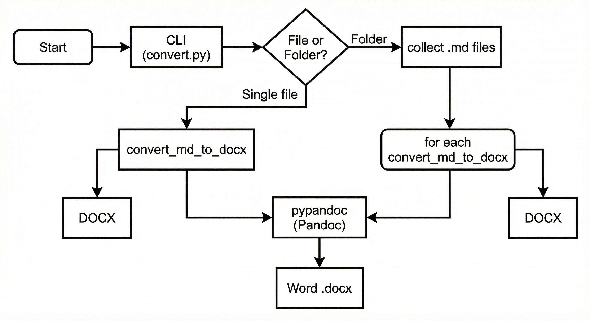
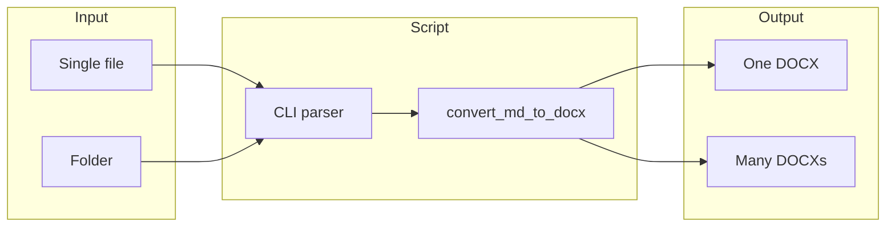

# md2docx – Sample Test Document

This document is a **comprehensive test** for the md2docx converter. It includes headings, lists, code, tables, images, flowcharts, and an explanation of how the tool works so you can verify that everything renders correctly in the generated Word file.

---

## How md2docx Works

md2docx is a Python CLI that converts Markdown (`.md`) files to Word (`.docx`) using **Pandoc** under the hood. You can convert a single file or an entire folder of Markdown files.

### High-level flow

The following flowchart shows the conversion flow from your command to the final DOCX:



**In words:**

1. You run `convert.py` with either `--file path/to/file.md` or `--folder path/to/dir`.
2. The script parses arguments and decides: single-file mode or folder mode.
3. In **single-file mode**, it calls `convert_md_to_docx()` once with the given input and output paths.
4. In **folder mode**, it discovers all `.md` files (optionally with `--recursive`), then for each file calls `convert_md_to_docx()`.
5. `convert_md_to_docx()` uses **pypandoc** (a Python wrapper for Pandoc) with the format `markdown+hard_line_breaks` to produce a Word document. An optional `--reference-doc` can apply consistent styles (fonts, headings, margins) to every output.

### Mermaid flowchart (for reference)

You can paste this into [Mermaid Live Editor](https://mermaid.live) to view or edit the diagram:



---

## Features Supported

The converter supports:

- **Single file conversion** – One `.md` file to one `.docx` file.
- **Folder conversion** – All `.md` files in a directory to separate `.docx` files.
- **Recursive mode** – Include subfolders when converting a folder (`--recursive`).
- **Output directory** – Write all DOCX files to a single folder (`--output-dir`).
- **Reference document** – Use a template DOCX for consistent styling (`--reference-doc`).

---

## Usage Examples

### Convert one file

```bash
python convert.py --file readme.md
# Creates readme.docx next to readme.md
```

```bash
python convert.py --file readme.md --output report.docx
# Creates report.docx at the given path
```

### Convert a folder

```bash
python convert.py --folder ./docs
# Each .md in ./docs becomes a .docx alongside it
```

```bash
python convert.py --folder ./docs --recursive --output-dir ./output
# All .md files (including subfolders) → ./output/*.docx
```

### Use from Python (e.g. in an AI agent)

```python
from convert import convert_md_to_docx

convert_md_to_docx("readme.md", "readme.docx")
convert_md_to_docx("readme.md", "styled.docx", reference_doc="template.docx")
```

---

## Project File Structure

| File or folder       | Purpose                                      |
|----------------------|----------------------------------------------|
| `convert.py`         | Main script: CLI, single-file and folder logic |
| `requirements.txt`   | Dependency: `pypandoc_binary`                 |
| `README.md`          | Install and usage instructions               |
| `test/`              | Test Markdown files and this sample          |
| `.github/workflows/`  | CI that runs the converter on push/PR        |

---

## Formatting Tests

### Text styling

- **Bold text** and *italic text*, plus ***bold italic***.
- Inline `code` in a sentence.
- A [link to the repo](https://github.com/RagingScout97/md2docx).

### Blockquote

> This is a blockquote. Use it for callouts, notes, or quoted text.  
> Multiple lines are supported.

### Nested list

1. First numbered item
   - Nested bullet A
   - Nested bullet B
2. Second numbered item
   - Another nested bullet
3. Third item

### Code blocks (multiple languages)

**Python:**

```python
def convert_md_to_docx(md_path, docx_path, reference_doc=None):
    import pypandoc
    extra_args = []
    if reference_doc:
        extra_args.extend(["--reference-doc", str(reference_doc)])
    pypandoc.convert_file(
        str(md_path), "docx", outputfile=str(docx_path),
        format="markdown+hard_line_breaks", extra_args=extra_args
    )
```

**Shell:**

```bash
pip install -r requirements.txt
python convert.py --file test/sample.md
```

### Table with more columns

| Option         | Short | Description                    |
|----------------|-------|--------------------------------|
| `--file`       | `-f`  | Path to a single .md file      |
| `--folder`     | `-d`  | Path to a folder of .md files  |
| `--output`     | `-o`  | Output path (single-file only) |
| `--output-dir` |       | Output directory (folder mode)|
| `--recursive`  | `-r`  | Include subfolders             |
| `--reference-doc` |    | Template DOCX for styles      |

### Horizontal rule

The line above this paragraph is a horizontal rule (`---` in Markdown).

---

## Summary

This sample covers:

- Headings (H1–H3)
- Paragraphs, bold, italic, inline code, links
- Unordered and ordered (numbered) lists, including nested
- Blockquotes
- Fenced code blocks (Python, Bash, Mermaid)
- Tables (simple and multi-column)
- An embedded image (flowchart) so you can confirm images appear in the DOCX
- Horizontal rules

After converting this file with `python convert.py --file test/sample.md`, open the generated `sample.docx` and check that all of the above render correctly.

*End of sample.*
